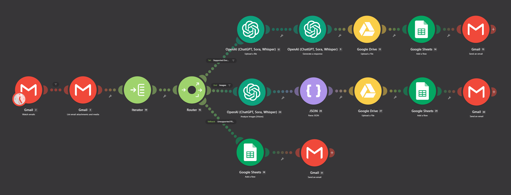

# AI File Processing Automation with Make.com

> **Working Proof of Concept | AI Automation Portfolio Project**

An AI-powered file processing workflow built with **Make.com, OpenAI, Gmail, Google Drive, and Google Sheets**.

The automation receives email attachments, validates supported file types, processes documents and images with AI, generates structured metadata and standardized filenames, stores processed files, records processing information, and sends automated notifications.

## Why This Project?

This project demonstrates how a repetitive file-processing workflow can be transformed into an automated AI-assisted pipeline.

### Core Capabilities

* 🤖 AI-powered document and image processing
* 🔀 Conditional file routing
* 📎 Multiple attachment handling
* 🏷️ Automated file naming
* ☁️ Automated file storage
* 📊 Structured metadata logging
* 📧 Automated notifications
* ⚠️ Unsupported-file handling
* 🧪 Tested working proof of concept

## Workflow at a Glance

```text
Gmail
  │
  ▼
Retrieve Attachments
  │
  ▼
Iterator
  │
  ▼
File Validation
  │
  ├─────────────── Supported ───────────────┐
  │                                        │
  │                                        ▼
  │                                   OpenAI AI
  │                                    Processing
  │                                        │
  │                                        ▼
  │                                Structured Output
  │                                  │             │
  │                                  ▼             ▼
  │                            Google Drive   Google Sheets
  │                                  │
  │                                  ▼
  │                            Gmail Notification
  │
  └──────────── Unsupported ───────────────► Gmail Rejection
```

## Project Documentation

| Document                                 | Purpose                                 |
| ---------------------------------------- | --------------------------------------- |
| [Architecture](docs/architecture.md)     | Understand the system and data flow     |
| [Implementation](docs/implementation.md) | Understand how to recreate the workflow |
| [Testing](docs/testing.md)               | Review proof-of-concept testing         |
| [Design Decisions](docs/decisions.md)    | Understand key design choices           |


---

## Supported File Types

| File Type                 | Processing  |
| ------------------------- | ----------- |
| PDF                       | ✅ Supported |
| DOCX                      | ✅ Supported |
| JPG                       | ✅ Supported |
| WEBP                      | ✅ Supported |
| Other/Unsupported Formats | ❌ Rejected  |

The workflow validates files before sending them to the appropriate processing path.

---

## AI Processing

The OpenAI API is used to analyze supported files and return structured information.

The workflow extracts or generates fields including:

| Field                 | Purpose                                                |
| --------------------- | ------------------------------------------------------ |
| `document_type`       | Identifies the general type of document                |
| `subject`             | Identifies the document subject                        |
| `source_organization` | Identifies the originating organization when available |
| `document_date`       | Identifies the relevant document date                  |
| `new_filename`        | Generates a standardized filename                      |
| `summary`             | Provides a concise document summary                    |

### Example

A document such as a Babylist birth plan can produce metadata similar to:

```text
Document Type: Birth Plan
Source Organization: Babylist
New Filename: Birth_Plan_Babylist.pdf
Summary: ...
```

The structured output can then be passed to downstream automation steps.

---

## Automation Flow

### 1. Monitor Gmail

The workflow monitors Gmail for incoming messages containing attachments.

### 2. Retrieve Attachments

Attachments are retrieved from the incoming email.

### 3. Process Multiple Attachments

An Iterator allows attachments to be processed independently instead of treating the email as a single file-processing operation.

### 4. Validate and Route Files

The workflow determines whether each attachment belongs to a supported file type.

Supported files continue to AI processing.

Unsupported files follow a rejection/notification path.

### 5. Process with OpenAI

Supported documents and images are sent to the OpenAI processing stage.

The AI generates structured metadata for downstream modules.

### 6. Store the File

Processed files are stored in Google Drive using the generated filename.

### 7. Record Metadata

Important processing information is recorded in Google Sheets.

### 8. Send the Result

Gmail sends an automated notification containing the processing result.

---

## Architecture

The automation is organized into several logical stages:

```text
┌─────────────────────┐
│        Gmail        │
│   Incoming Email    │
└──────────┬──────────┘
           │
           ▼
┌─────────────────────┐
│  List Attachments   │
└──────────┬──────────┘
           │
           ▼
┌─────────────────────┐
│      Iterator       │
│ Process Each File   │
└──────────┬──────────┘
           │
           ▼
┌─────────────────────┐
│   File Validation   │
└──────────┬──────────┘
           │
       ┌───┴────┐
       │        │
       ▼        ▼
  Supported  Unsupported
       │        │
       ▼        ▼
   OpenAI     Gmail
       │      Rejection
       ▼
Structured Output
       │
   ┌───┴─────────┐
   ▼             ▼
Google Drive  Google Sheets
   │
   ▼
 Gmail Result
```

For a detailed explanation of the architecture, see:

**[Architecture Documentation](docs/architecture.md)**

---

## Proof of Concept

The automation was implemented and tested in Make.com.



The proof of concept successfully demonstrates:

- PDF processing
- DOCX processing
- JPG processing
- WEBP processing
- Multiple attachment handling
- Unsupported file handling
- AI-generated structured output
- Google Drive storage
- Google Sheets logging
- Gmail notifications

[View detailed testing documentation](docs/testing.md)

---

## Error and Unsupported File Handling

The workflow does not assume that every incoming attachment can be processed.

Unsupported files are routed away from the AI processing path and handled through a separate notification flow.

This prevents unsupported inputs from unnecessarily reaching downstream processing modules.

Additional implementation and design decisions are documented in:

**[Design Decisions](docs/decisions.md)**

---

## Technology Stack

| Technology        | Purpose                                        |
| ----------------- | ---------------------------------------------- |
| **Make.com**      | Workflow automation and orchestration          |
| **OpenAI API**    | AI-powered file analysis and structured output |
| **Gmail**         | Email input, attachments, and notifications    |
| **Google Drive**  | Processed file storage                         |
| **Google Sheets** | Metadata and processing records                |

---

## Project Structure

```text
make-ai-file-processing-automation/
│
├── README.md
│
├── docs/
│   ├── architecture.md
│   ├── implementation.md
│   ├── testing.md
│   └── decisions.md
│
├── screenshots/
│
├── sample-data/
│   └── README.md
│
└── .gitignore
```

### Documentation

| Document                                 | Purpose                                    |
| ---------------------------------------- | ------------------------------------------ |
| [Architecture](docs/architecture.md)     | System architecture and data flow          |
| [Implementation](docs/implementation.md) | Implementation and configuration guide     |
| [Testing](docs/testing.md)               | Test cases and proof-of-concept results    |
| [Design Decisions](docs/decisions.md)    | Important technical and workflow decisions |

---

## Security & Privacy

This repository should contain only safe demonstration material.

Do not commit:

* API keys
* Passwords
* OAuth tokens
* Credentials
* Private documents
* Personal email content
* Personally identifiable information
* Confidential business information

Screenshots should be reviewed before publication to ensure sensitive information is not exposed.

---

## Lessons Learned

This project provided practical experience with:

* Designing multi-step automation workflows
* Connecting multiple SaaS platforms
* Integrating an AI API into an automation
* Processing different file types
* Handling multiple attachments
* Routing different processing conditions
* Working with structured AI output
* Passing data between automation modules
* Designing unsupported-input handling
* Testing automation behavior across multiple scenarios

---

## Future Improvements

Potential future improvements include:

* Additional document formats
* More advanced document classification
* Improved confidence/error reporting
* Human approval workflows
* Duplicate-file detection
* Enhanced logging
* Retry mechanisms
* Additional storage and notification integrations
* More sophisticated document routing

---

## Project Status

**Completed — Working Proof of Concept**

The automation has been built and tested in Make.com.

This repository documents the project architecture, implementation approach, testing results, and design decisions.

---

## Author

**Ariel Calangian**

AI Automation Portfolio Project
