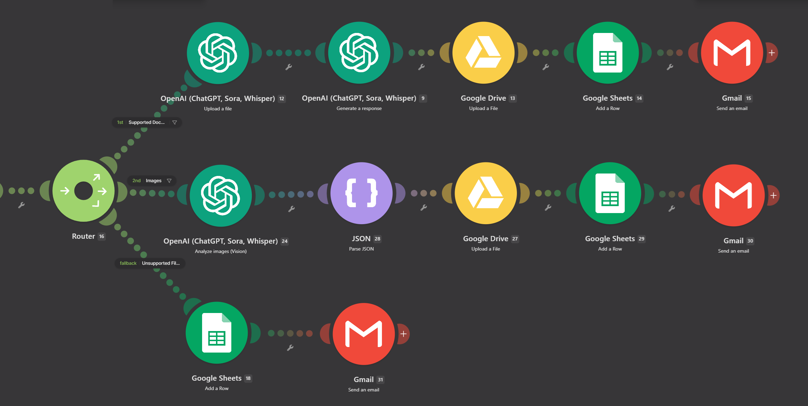
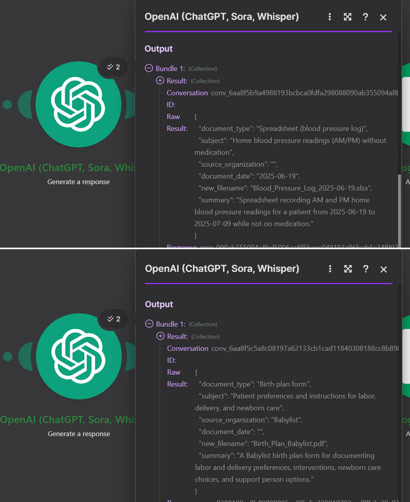
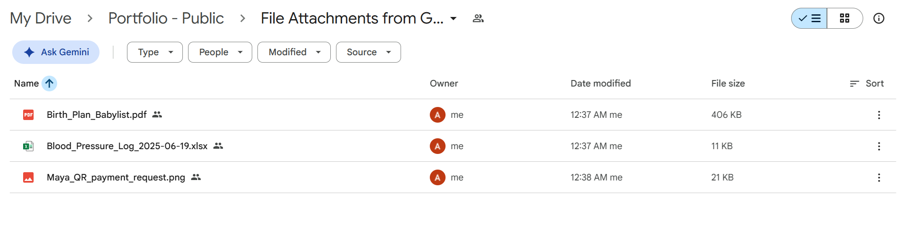
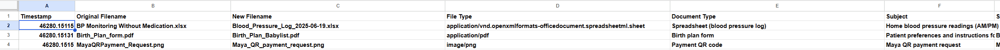
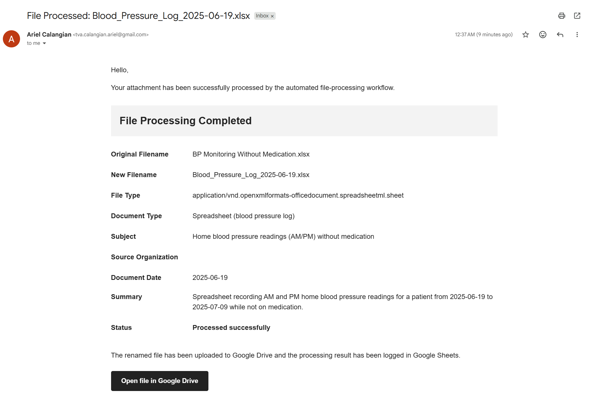

# Testing & Proof of Concept

## 1. Testing Overview

The automation was tested as a working proof of concept using different attachment types and processing conditions.

Testing focused on verifying:

* File type handling
* Multiple attachment processing
* AI processing
* Structured output
* File storage
* Metadata logging
* Email notifications
* Unsupported file handling

---

## 2. Test Environment

| Component           | Technology    |
| ------------------- | ------------- |
| Automation Platform | Make.com      |
| AI Service          | OpenAI API    |
| Email               | Gmail         |
| File Storage        | Google Drive  |
| Metadata Logging    | Google Sheets |

---

## 3. Supported File Testing

The following file types were tested through the supported processing workflow.

| Test  | Input | Expected Behavior     | Result   |
| ----- | ----- | --------------------- | -------- |
| TC-01 | PDF   | File processed by AI  | ✅ Passed |
| TC-02 | DOCX  | File processed by AI  | ✅ Passed |
| TC-03 | JPG   | Image processed by AI | ✅ Passed |
| TC-04 | WEBP  | Image processed by AI | ✅ Passed |

---

## 4. Multiple Attachment Testing

### TC-05 — Multiple Attachments

**Objective**

Verify that multiple attachments within a single email can be processed independently.

**Input**

An email containing multiple supported attachments.

**Expected Result**

Each attachment is passed through the appropriate processing workflow independently.

**Result**

✅ Passed

The Iterator allows attachments to be processed individually rather than treating the email as a single file.

---

## 5. Unsupported File Testing

### TC-06 — Unsupported File

**Objective**

Verify that unsupported file types do not continue through the supported AI processing workflow.

**Input**

An unsupported attachment format.

**Expected Result**

The file is routed to the unsupported-file handling path and a rejection/notification email is generated.

**Result**

✅ Passed

---

## 6. AI Processing Validation

The OpenAI processing stage was verified to produce structured output containing fields used by downstream modules.

Expected structured fields include:

```text
document_type
subject
source_organization
document_date
new_filename
summary
```

### Example

A Babylist birth plan was processed into structured information including:

```text
Document Type: Birth Plan
Source Organization: Babylist
New Filename: Birth_Plan_Babylist.pdf
```

The generated filename was then used by the downstream file-storage workflow.

**Result:**

✅ Passed

---

## 7. Output Validation

### Google Drive

Processed files were successfully passed to the Google Drive storage stage using the generated filename.

**Result:**

✅ Passed

### Google Sheets

Structured processing information was passed to Google Sheets for logging.

**Result:**

✅ Passed

### Gmail

The workflow generated processing-result notifications through Gmail.

**Result:**

✅ Passed

---

## 8. End-to-End Proof of Concept

The complete workflow was verified across the major stages:

```text
Gmail
  ↓
Attachment Retrieval
  ↓
Iterator
  ↓
File Validation / Routing
  ↓
OpenAI Processing
  ↓
Structured Output
  ↓
Google Drive
  ↓
Google Sheets
  ↓
Gmail Notification
```

The unsupported-file path was also verified:

```text
Gmail
  ↓
Attachment
  ↓
File Validation
  ↓
Unsupported File
  ↓
Rejection Notification
```

---

## 9. Test Summary

| Area                  | Status   |
| --------------------- | -------- |
| PDF Processing        | ✅ Passed |
| DOCX Processing       | ✅ Passed |
| JPG Processing        | ✅ Passed |
| WEBP Processing       | ✅ Passed |
| Multiple Attachments  | ✅ Passed |
| Unsupported Files     | ✅ Passed |
| AI Structured Output  | ✅ Passed |
| Google Drive Storage  | ✅ Passed |
| Google Sheets Logging | ✅ Passed |
| Gmail Notification    | ✅ Passed |

---

## 10. Proof of Concept Evidence

Screenshots demonstrating the working automation are stored in the repository's `screenshots/` directory.

### Workflow


### File Routing



### AI Processing



### Google Drive Output



### Google Sheets Output



### Successful Processing Notification



### Unsupported File Handling


---

## 11. Testing Notes

This project is documented as a **working proof of concept**, not as a production deployment.

The testing demonstrates that the designed workflow can process supported inputs, generate AI-based structured information, pass results to downstream services, and handle unsupported inputs through a separate route.

Production implementation would require additional considerations such as authentication management, monitoring, retry policies, scalability, cost controls, and more extensive test coverage.
